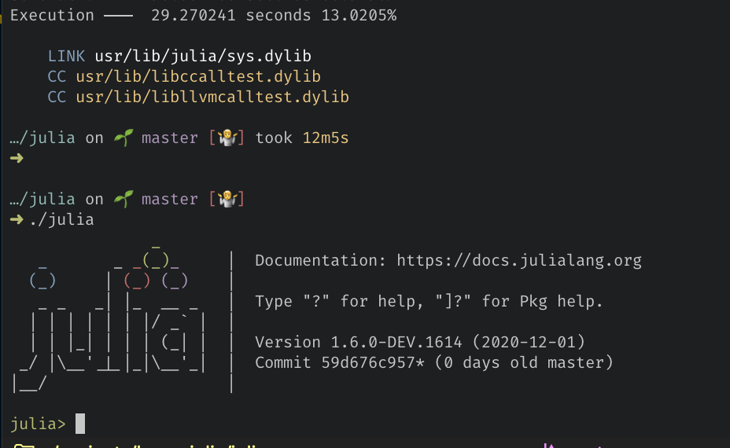

# 100 Days Of Code - Log

## Day 0: 2020-11-28 Saturday

**Today's Progress**:
HTML, CSS Refresher. Selectors. Flexbox and positioning.

**Thoughts:**
Lots of details. Different type of selectors. CSS hierarchy makes
more sense now. Finding a good cheatsheet for html elements and
CSS hierarchy would be helpful.

**Link to work:**
Handwritten notes. Will scan into image.

## Day 1: 2020-11-29 Sunday

**Today's Progress**:

- Explore [Julia site](https://julialang.org/)
- Static Site Generator [Franklin](https://github.com/tlienart/Franklin.jl) and [Franklin templates](https://github.com/tlienart/FranklinTemplates.jl)
- Explore [Literate.jl](https://fredrikekre.github.io/Literate.jl/v2/)
- Checkout [Documenter.jl](https://juliadocs.github.io/Documenter.jl/stable/)

**Thoughts:**

The Julia ecosystem has grown significantly since [JuliaCon 2017](https://juliacon.org/2017/).
It's great that there are more tools for documentation and
teaching available to support sharing the language.

Cool tip to get into `Pkg` mode: type `]`
To get back to REPL, use backspace or Ctl-c.

**Link to work:**

Repo: https://github.com/pysplash/jupy-smores
- uses Franklin: SSG for Julia

[Rendered site](https://pysplash.github.io/jupy-smores)

## Day 2: 2020-11-30 Monday

**Today's Progress**:

Explore the Julia website and ecosystem
- [Julia Observer](https://juliaobserver.com/about): package browser
- [JuliaHub](https://juliahub.com/ui/Home): another way to explore packages

Joined:
- Discourse
- Julia D&I Slack https://discourse.julialang.org/t/diversity-and-inclusion-in-the-julia-community/50271

Build Julia from source
- Install gfortran using brew
- Run `make`
- Run `./julia` to enter REPL

Fork IJulia

**Thoughts:**

Packaging has really improved since 2017 and it's nice to have tools to
sort and review packages and info about them.

**Link to work:**

Added 100 days of code log to Franklin SSG https://pysplash.github.io/jupy-smores/

---

## Day x: 2020-mm-dd Day_of_week

**Today's Progress:**

**Thoughts:**

**Link to work:**
